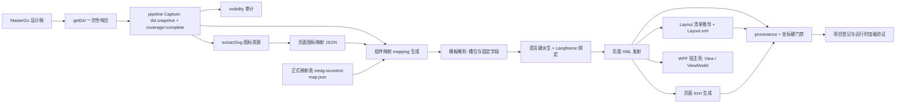

# mastergo-wpf-transcoder 项目架构

> 本文只讲**架构与关键组成**，不逐文件罗列。字段级规则请看 `skills/mastergo-to-wpf/references/`，流程细节看 `skills/mastergo-to-wpf/SKILL.md`，团队/设计师口径看飞书在线文档（见文末"文档分层"）。

## 1. 插件是什么

把明确指定的 MasterGo 设计稿转换成能通过目标项目硬门禁的 **MTSLG IOContorl 页面**：页面 XML、页面 Icon（XAML Geometry）、多语言字典、Layout 注册、mapping/provenance 审计，以及目标项目要求的 WPF 宿主壳（View / code-behind / ViewModel）与构建登记。

插件内保留两条路线：

| 路线 | Adapter | 状态 | 说明 |
|---|---|---|---|
| **作业 B** | `mtslg-iocontrol` | **当前唯一启用** | 完整页面交付链路；本架构文档的主体 |
| 作业 A | `mw-wpf` | 资料保留、暂不开放 | 重新启用前必须完成全篇复核（含本页 Icon 字典的合并点） |

## 2. 顶层结构

```text
plugins/mastergo-wpf-transcoder/
├─ .claude-plugin/plugin.json      # 插件清单（名称、版本号）
├─ README.md                       # 安装、能力概览、本地验证入口
├─ ARCHITECTURE.md                 # 本文
├─ skills/
│  ├─ mastergo-to-wpf/             # 主 Skill：流程路由 + 参考文档 + 全部脚本
│  │  ├─ SKILL.md                  # 唯一流程路由与硬规则总表
│  │  ├─ references/               # 规则事实源（适配器文档、映射表、框架手册）
│  │  └─ scripts/                  # 交付链路脚本（运行时）
│  │     └─ tests/                 # 开发期回归测试（CI 不跑，本地跑）
│  └─ mastergo-iocontrol-document-format/   # 映射文档写作规范 Skill
└─ docs/                           # 插件级说明文档
```

## 3. 交付链路（数据流）



要点：

- **整页 DSL 只读一次**，响应只落盘、不进模型上下文；`coverage` 必须 `complete`。
- **出码由脚本完成**，模型只负责组件语义映射与待确认清单；未命中映射的组件不降级。
- **门禁是硬失败**（非零退出即禁止交付），不是警告报告。

## 4. 关键脚本（按阶段）

| 阶段 | 关键脚本 | 职责 |
|---|---|---|
| 采集 | `call-mastergo-mcp.js`、`mastergo-dsl-pipeline.ps1` | 调 MCP、落盘快照、校验根/父子链/唯一 ref、产出覆盖报告 |
| 事实提取 | `resolve-mastergo-visibility.js` | 机械输出可见性与 TEXT/PATH 索引，不判控件类型 |
| 图标 | `discover-mtslg-page-icon-map.js`、`gen-mtslg-page-icons.js` | 发现候选、生成页面 Icon（XAML Geometry） |
| 映射 | `gen-mtslg-mapping-from-dsl.js`、`resolve-mtslg-template-mapping.js` | 从 DSL 建立 mapping、按模板解析槽位与固定字段 |
| Layout | `gen-mtslg-layout-manifest.js`、`gen-mtslg-layout.js` | 机械推导 `menuItems` 清单、发射/增量更新 Layout.xml |
| 页面发射 | `gen-iocontrol-xml.js` | 发射页面 IOContorl XML（fresh / merge） |
| 多语言 | `gen-mtslg-lang-keys-from-dsl.js`、`gen-mtslg-page-lang.js` | 派生语言键、发射 CN/EN 字典 |
| 宿主 | `gen-mw-wpf-page.js` | 生成 View / code-behind / ViewModel 与 csproj 登记 |
| 编排 | **`gen-mastergo-page-bundle.js`（主入口）** | 串起模板解析 → 语言键 → LangName → XML → 校验 → Icon → Layout → 宿主 → 最终校验 |
| 门禁 | `validate-iocontrol-provenance.js`、`check-iocontrol-coords.js` | 来源闭环、必写字段、坐标 0 MISMATCH / 0 EXTRA |
| 审计/运维 | `audit-mtslg-feishu-map.js`、`classify-mastergo-groups.js`、`scan-mtslg-keys.ps1`、`sync-to-mt.ps1`、`cap-window*.ps1` | 文档覆盖审计、组件分类、键查证、运行目录同步、视觉截图 |

## 5. 规则与文档分层（谁是事实源）

| 层 | 位置 | 作用 |
|---|---|---|
| 组件结构与固定字段 | `references/adapters/mtslg-iocontrol/mtslg-iocontrol-map.json` | **机器可读事实源**：`controlTypes`、`controlTypeRequiredAttrs`、`controlTypeAttrDefaults`、`buttonFamily`、`layoutRules`、各模板族 |
| 组件映射说明 | `references/adapters/mtslg-iocontrol/feishu-component-library-mapping.md` | 模板与槽位的人读口径（在线同步） |
| 页面壳层与 Layout | `references/adapters/mtslg-iocontrol/feishu-layout-mapping.md` | MenuItem 常驻属性、Index、设计稿标记（在线同步） |
| 页面格式与验证 | `references/adapters/mtslg-iocontrol/mtslg-mode.md` | 坐标、TextBlock 尺寸、运行时约束、验证流程 |
| 流程路由与硬规则 | `skills/mastergo-to-wpf/SKILL.md` | **唯一流程路由**；不在别处复制流程 |
| 跨适配器语义 | `references/mastergo-component-mapping-rules.md` | 组件身份与来源链通用规则 |
| 团队/设计师口径 | 飞书在线文档 ×4 | 权威阅读版本，与本地规则保持同步 |

原则：**一个规则只保留一个权威来源**；改规则时同步"映射表 → 说明文档 → 在线文档 → 生成/校验脚本 → 回归测试"。

## 6. 产物布局（作业 B）

```text
<ProjectRoot>/
├─ Resources/Pages/<页面名>/
│  ├─ <页面名>Page.xml          # IOContorl 页面
│  ├─ <页面名>Icons.xaml        # 页面 Icon（Geometry 资源字典）
│  └─ <页面名>_CN.xaml / _EN.xaml   # 多语言字典（按页自包含）
├─ Resources/Layout/Layout.xml  # 页面壳层注册（增量更新）
└─ UI/<区域>/View|ViewModel/    # 宿主壳

<ArtifactOutputRoot>/Generated/  # 项目外证据：mapping / icon-map / bundle.manifest / lang-translations / lang-glossary
```

- 旧路径（`Common/Pages`、`Resources/Icons`、`Resources/Files/Layout.xml`）**已废弃**。
- `framework.config.json` 的 `pages_root` / `icons_root` / `layout_file` 必须与实际产物一致（`sync-to-mt.ps1` 依赖 `pages_root`），`key_catalog` 默认空。

## 7. 硬门禁与质量约束

1. **来源闭环**：每个节点可回溯到唯一 DSL ref 与父节点链，`Value` 与设计文本一致。
2. **必写字段**：每个 ControlType 按 `controlTypeRequiredAttrs` 恒写；按钮族（IconButton / Button / StatusButton）恒写 `PageName` / `IOVisible` / `IOCommand` / `IOEnable`，IconButton 另有 `Icon` / `IconWidth` / `IconHeight`。
3. **坐标**：`contentOriginY = 192` 全局固定；TextBlock `Width=NaN` / `Height=40`；坐标 0 MISMATCH / 0 EXTRA。
4. **Layout**：`menuItems` 机械推导；MenuItem 常驻属性恒写；`IsNeedRedMark`（红字文案）/ `IsShowStatus`（左上角状态方框）命中才写；带 `Icon` 必须有 `iconSize`。
5. **Icon**：键页面内唯一且闭合，页面 XML / Layout 引用的键必须存在于本页 Icon 文件；View 不合并本页 Icon 字典。
6. **多语言**：默认开启，`LangName` 引用闭环；同一文案共用一个键；标题取 `textAudit` 的 `page-title`（来源写入 `titleSource`）。
7. **发射顺序**：同一父节点下按设计坐标 Top → Left，与 DSL 图层树顺序解耦。

## 8. 多语言链路

```text
DSL/mapping 文案 ──► 机械派生语言键（标题 / MenuItem / 页面内容）
                 ──► 同页同文案共用一个 key
                 ──► 英文等译文由 AI 产出 translations 清单并落盘
                 ──► 发射 <页面名>_CN.xaml / _EN.xaml（各语言 key 完全一致）
                 ──► LangName 绑定 → 门禁校验引用闭环
```

页面字典**自包含**：不复用项目里已登记的跨页键（`keyCatalog` 是可选的显式复用开关，默认关闭）。

## 9. 扩展点（怎么加东西）

| 需求 | 改哪里 |
|---|---|
| 新增组件/变体模板 | `mtslg-iocontrol-map.json` 的对应模板族 + `feishu-component-library-mapping.md` + 回归用例 |
| 新增控件类型的固定字段 | `controlTypeRequiredAttrs`（+ `controlTypeAttrDefaults`）；发射与校验自动跟随 |
| 新增页面 | 写 bundle 输入清单（`dslPath`/`visibilityPath`/`iconMapPath`/`menuItems`…）→ 跑 `gen-mastergo-page-bundle.js` |
| 新增语言 | manifest 的 `languages.locales` + 对应译文清单 |
| 新增 Layout 行为 | `layoutRules.bottomBar`（含 `menuItemFlags`）+ `feishu-layout-mapping.md` |
| 新增校验 | 加到 `validate-iocontrol-provenance.js` / `check-iocontrol-coords.js`，并补 fixture |

## 10. 环境与运行

- **PowerShell 脚本一律用 PowerShell 7（`pwsh`）**，不做 Windows PowerShell 5.1 兼容。
- Node.js 运行全部 JS 脚本；MasterGo MCP 通过 `call-mastergo-mcp.js` 调用（token 不落盘）。
- 本地回归：`node --test "skills/mastergo-to-wpf/scripts/tests/*.test.js"`（17 个）、`pwsh -NoProfile -File skills/mastergo-to-wpf/scripts/tests/mastergo-dsl-pipeline.tests.ps1`、`node skills/mastergo-to-wpf/scripts/audit-mtslg-feishu-map.js <doc> <map>`。
- CI（`BigStartByXuyb/cicd` 复用工作流）只做**确定性校验 + 语义审计**，不跑上述单测；单测由提交者在本地执行。

## 11. 维护约定

- 规则/脚本改动只提交到插件仓库 `plugins/mastergo-wpf-transcoder/`（`master_go` 产物不提交）。
- 每次插件发版前，把本地规则文档按"整篇重建"同步到 4 份飞书在线文档，并记录 revision 便于回滚。
- 版本号写在 `.claude-plugin/plugin.json`；发版时递增，避免同版本号内容漂移。
- 不要在上一次 CI run 未结束时连续 push（会被 concurrency 取消，产生空审计报告）。
